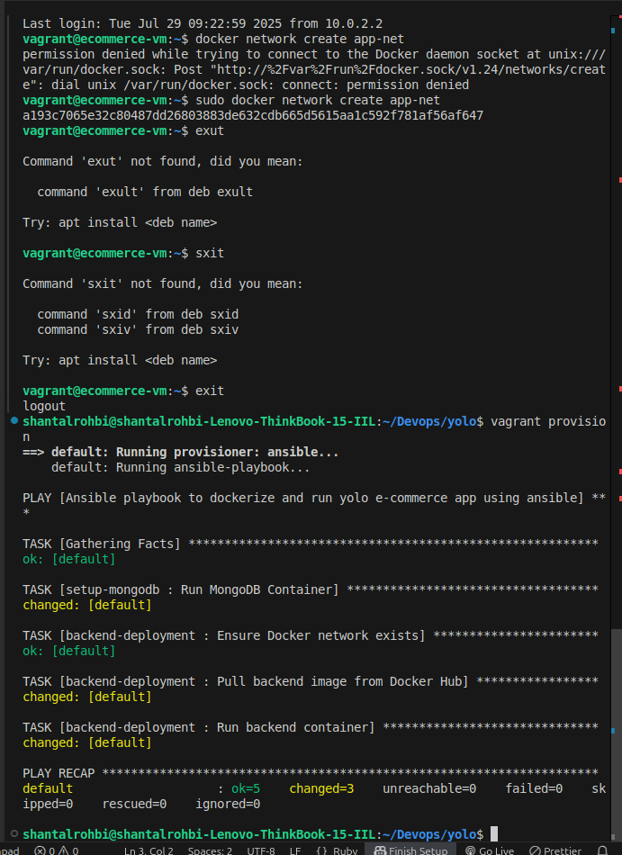

ANSIBLE 
# EXPLANATION.md

## 🧠 Execution Reasoning

This document outlines the order of execution in the Ansible playbook and explains each role and the Ansible modules applied within them.

---

## 🔄 Playbook Execution Order

The `playbook.yml` is executed sequentially with the following structure:

1. **common**: Sets up the base environment (updates, installs Docker & dependencies)
2. **database**: Pulls and configures the MySQL/PostgreSQL container
3. **backend**: Pulls and configures the backend container (Flask/Node/etc.)
4. **frontend**: Pulls and configures the frontend container (React/Angular/etc.)

Each role is clearly defined and tagged for modular execution.

---

## 🧱 Roles Breakdown

### 1. `common`
**Purpose**: Prepares the environment
- Installs updates
- Installs Docker & Docker Compose
- Starts Docker service

**Modules Used**:
- `apt`
- `service`
- `docker_container` (for verification)

---

### 2. `database`
**Purpose**: Containerizes and runs the database
- Creates a volume
- Sets environment variables
- Ensures persistence

**Modules Used**:
- `docker_container`
- `copy`
- `file`

---

### 3. `backend`
**Purpose**: Sets up backend API server
- Clones code from GitHub
- Builds backend Docker image
- Runs backend container

**Modules Used**:
- `git`
- `docker_image`
- `docker_container`

---

### 4. `frontend`
**Purpose**: Sets up user-facing client
- Builds frontend image
- Runs frontend container
- Ensures communication with backend

**Modules Used**:
- `docker_image`
- `docker_container`

---

## 🧩 Use of Variables

All credentials, ports, and reusable config values are defined in:

```yaml
vars/main.yml
```

This promotes DRY principles and easier maintainability.

---

## 🔖 Blocks and Tags

Each task block is grouped with a logical tag for testing:

```yaml
tags:
  - setup
  - database
  - backend
  - frontend
```

Y

## 🧪 Testing and Validation

- The application is validated by accessing the frontend in a browser.
- The “Add Product” form is used to confirm data persistence.
- Docker logs confirm container health.

---


## ✅ Final Output

By the end of the playbook:
- All containers are up and healthy
- 
- The application is live and accessible
- Data can be added and persisted


DOCKER
This project involved the containerization and deployment of a full-stack yolo application using Docker.


# Requirements
Install the docker engine here:
- [Docker](https://docs.docker.com/engine/install/) 

## How to launch the application 


## How to run the app..
Use vagrant up 
